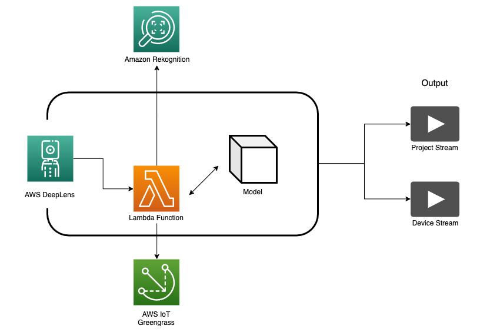

# AWS DeepLens 로 얼굴 인식 기기 만들기

---

AWS DeepLens는 딥 러닝 기술을 확장하도록 설계된 완전히 프로그래밍 가능한 비디오카메라, 자습서, 코드 및 사전 교육된 모델을 통해 쉽고 빠르게 기계학습을 구현할 수 있는 도구입니다.

이 워크샵에서는 AWS DeepLens 와 Amazon Rekognition 을 이용하여 영상에서 사람의 얼굴을 인식하고, 신원을 확인하는 시스템을 구축합니다.

---

© 2020 Amazon Web Services, Inc. 또는 자회사, All rights reserved.

