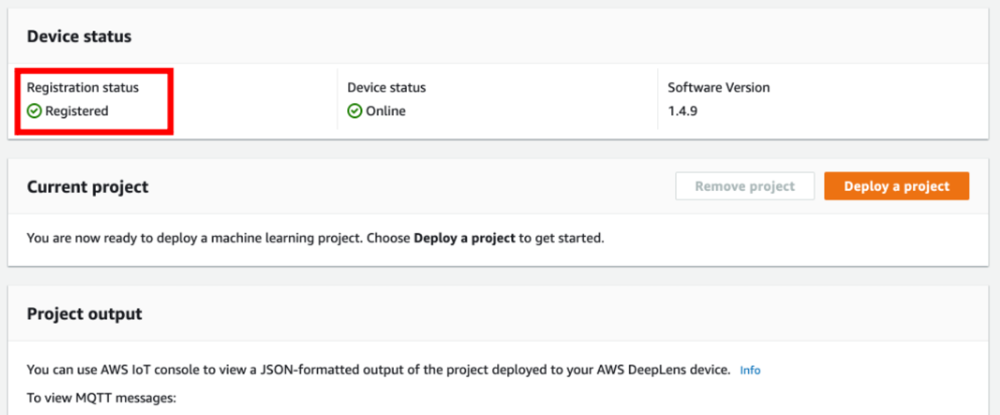

### DeepLens 등록하기

워크샵을 시작하기에 앞서, 작동하는 DeepLens 기기와 AWS 계정을 준비해 주십시오. 워크샵을 진행하기 위해 DeepLens 기기를 계정에 등록해야 합니다.

1. [AWS DeepLens 콘솔창](https://console.aws.amazon.com/deeplens) 에 접속한 후, Register device 버튼을 누릅니다.
2. 가지고 있는 기기의 버전을 확인한 후, Start 버튼을 누릅니다.
3. 화면의 안내를 따라, 기기 연결을 시작합니다.
    * DeepLens 기기를 전원에 연결합니다.
    * 전원 버튼을 누르면, 노란 불빛이 깜빡이다가, 파란 불빛이 들어옵니다.
    * Registration 이라고 적힌 USB 포트를 이용해 컴퓨터와 기기를 연결합니다.
    * 연결이 완료되었으면, Detect AWS DeepLens device 버튼을 누르고, 화면 하단의 Next 버튼이 활성화 될 때까지 기다립니다.
    * 화면 안내를 따라, 기기 하단에 기재되어 있는 serial number 를 입력합니다.
    * 네트워크 환경을 확인한 후, Next 버튼을 누릅니다.
    * Device Name 을 설정하고, Permission 부분의 체크박스를 체크한 후, Register Device 버튼을 누릅니다.
    * Device 페이지로 이동하면, Device Status 가 In progress 에서 Registered 로 바뀔 때까지 기다립니다.
    * 등록이 완료되면 다음과 같은 화면이 나옵니다.

---

© 2020 Amazon Web Services, Inc. 또는 자회사, All rights reserved.

