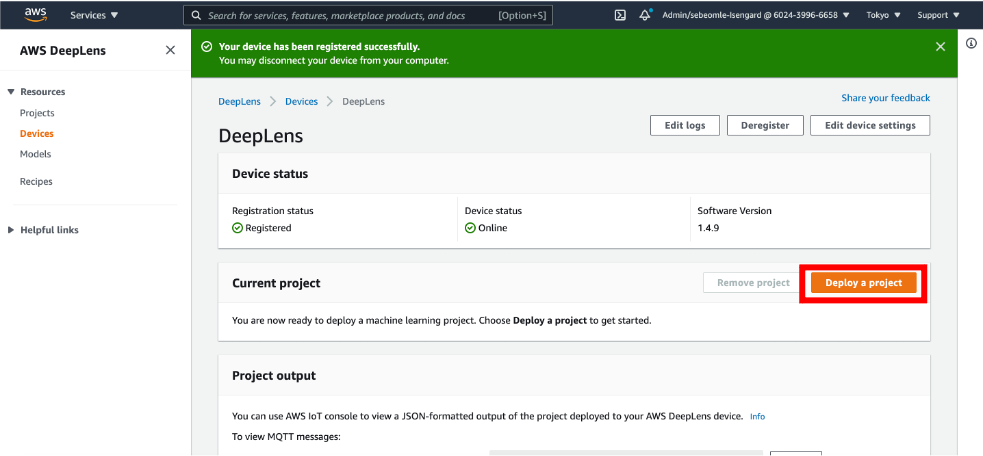
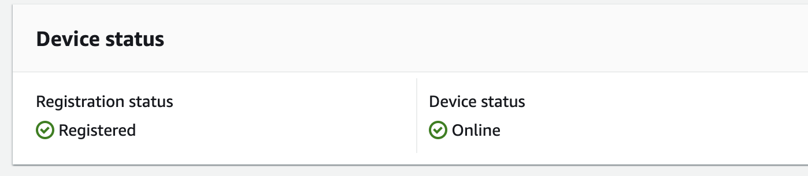

### 프로젝트 생성하기

DeepLens 에서 제공하는 모델을 이용하여 얼굴 인식 프로젝트를 생성합니다.

1. 디바이스 페이지에서 Deploy Project 버튼을 누릅니다.

2. 프로젝트 페이지로 이동하면, Create new project 버튼을 누릅니다.
3. Use a project template 을 선택하고, 템플릿 중, Face detection 을 선택하고 Next 버튼을 누릅니다.
4. 설정을 건드리지 않고 Create 버튼을 누릅니다.
5. 프로젝트가 생성되었는지 확인합니다. 만약 Description 등 항목이 나타나지 않을 경우, 페이지를 새로고침 해봅니다.

### 프로젝트를 기기에 배포하기

생성한 얼굴 인식 프로젝트를 DeepLens 기기에 배포합니다.

1. 생성된 프로젝트를 클릭합니다.
2. 우측 상단의 Deploy to device 버튼을 누릅니다.
3. Target device 에 등록한 디바이스가 나타납니다. 선택 후 Review 버튼을 누릅니다.
4. Deploy 버튼을 누릅니다.
5. Deploy 가 완료될 때까지 기다립니다.
6. 완료되면 Device status 가 online 으로 바뀝니다.

---

© 2020 Amazon Web Services, Inc. 또는 자회사, All rights reserved.

