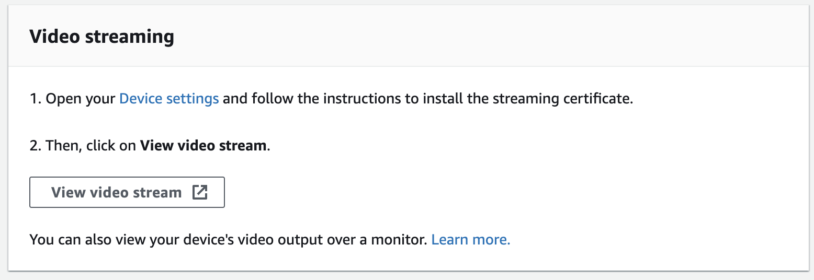

### 결과 화면 관찰하기

얼굴 인식 프로젝트에서 출력되는 결과 화면을 관찰합니다.

이 워크샵에서는 브라우저를 이용해서 결과 화면을 관찰합니다.

프로젝트 출력을 보는 다른 방법은 다음 링크에서 확인할 수 있습니다.
[프로젝트 출력 보기](https://docs.aws.amazon.com/ko_kr/deeplens/latest/dg/deeplens-viewing-output.html)

#### 브라우저에서 결과 화면 확인하기

1. DeepLens 에서 송출되는 화면을 받기 위해서, 인증서를 가져와야 합니다.
인증서를 가져와서 브라우저에 등록하는 방법은 [다음 링크](https://docs.aws.amazon.com/ko_kr/deeplens/latest/dg/deeplens-viewing-device-output-in-browser.html#deeplens-view-device-stream-in-browser-proc) 에서 확인할 수 있습니다.

2. 디바이스 화면에서 Video Streaming 항목에 있는 View Video stream 버튼을 누릅니다.

3. 위 버튼은 당신을 https://{디바이스-ip-주소}:4000 로 데려갈 것입니다. 원하는 브라우저에 주소를 복사해서, 비디오 스트림을 관찰합니다.

---

© 2020 Amazon Web Services, Inc. 또는 자회사, All rights reserved.

