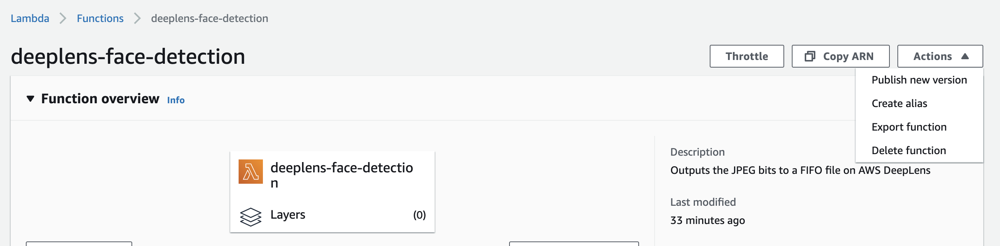

### 프로젝트 함수 변경하기
1. [Lambda 콘솔 페이지](https://console.aws.amazon.com/lambda) 로 이동합니다.
2. 함수 중에 deeplens-face-detection 이라는 함수를 클릭합니다. 이 함수가 DeepLens 기기에 설치되는 함수입니다.
3. 함수의 코드를 모두 지우고, 다음 코드로 변경합니다.


```{python}
from threading import Thread, Event
import os
import json
import numpy as np
import awscam
import cv2
import greengrasssdk
import sys
import urllib
import zipfile
import time


# Latest software has boto3 installed
try:
    import boto3
except Exception:
    boto_dir = '/tmp/boto_dir'
    if not os.path.exists(boto_dir):
        os.mkdir(boto_dir)
    urllib.urlretrieve("https://s3.amazonaws.com/dear-demo/boto_3_dist.zip", "/tmp/boto_3_dist.zip")
    with zipfile.ZipFile("/tmp/boto_3_dist.zip", "r") as zip_ref:
        zip_ref.extractall(boto_dir)
    sys.path.append(boto_dir)
    import boto3


def mark_face(image, bbox, label=""):
    H, W, _ = image.shape
    x = int(bbox["Left"] * W)
    y = int(bbox["Top"] * H)
    w = int(bbox["Width"] * W)
    h = int(bbox["Height"] * H)
    
    cv2.rectangle(image, (x, y), (x + w, y + h), (255, 165, 20), 10)
    text_offset = 15
    cv2.putText(image, label,
                (x, y - text_offset),
                cv2.FONT_HERSHEY_SIMPLEX, 2.5, (255, 165, 20), 3)    


class LocalDisplay(Thread):
    """ Class for facilitating the local display of inference results
        (as images). The class is designed to run on its own thread. In
        particular the class dumps the inference results into a FIFO
        located in the tmp directory (which lambda has access to). The
        results can be rendered using mplayer by typing:
        mplayer -demuxer lavf -lavfdopts format=mjpeg:probesize=32 /tmp/results.mjpeg
    """
    def __init__(self, resolution):
        """ resolution - Desired resolution of the project stream """
        # Initialize the base class, so that the object can run on its own
        # thread.
        super(LocalDisplay, self).__init__()
        # List of valid resolutions
        RESOLUTION = {'1080p' : (1920, 1080), '720p' : (1280, 720), '480p' : (858, 480)}
        if resolution not in RESOLUTION:
            raise Exception("Invalid resolution")
        self.resolution = RESOLUTION[resolution]
        # Initialize the default image to be a white canvas. Clients
        # will update the image when ready.
        self.frame = cv2.imencode('.jpg', 255*np.ones([640, 480, 3]))[1]
        self.stop_request = Event()

    def run(self):
        """ Overridden method that continually dumps images to the desired
            FIFO file.
        """
        # Path to the FIFO file. The lambda only has permissions to the tmp
        # directory. Pointing to a FIFO file in another directory
        # will cause the lambda to crash.
        result_path = '/tmp/results.mjpeg'
        # Create the FIFO file if it doesn't exist.
        if not os.path.exists(result_path):
            os.mkfifo(result_path)
        # This call will block until a consumer is available
        with open(result_path, 'w') as fifo_file:
            while not self.stop_request.isSet():
                try:
                    # Write the data to the FIFO file. This call will block
                    # meaning the code will come to a halt here until a consumer
                    # is available.
                    fifo_file.write(self.frame.tobytes())
                except IOError:
                    continue

    def set_frame_data(self, frame):
        """ Method updates the image data. This currently encodes the
            numpy array to jpg but can be modified to support other encodings.
            frame - Numpy array containing the image data tof the next frame
                    in the project stream.
        """
        ret, jpeg = cv2.imencode('.jpg', cv2.resize(frame, self.resolution))
        if not ret:
            raise Exception('Failed to set frame data')
        self.frame = jpeg

    def join(self):
        self.stop_request.set()

def infinite_infer_run():
    """ Entry point of the lambda function"""
    try:
        # This face detection model is implemented as single shot detector (ssd).
        model_type = 'ssd'
        output_map = {1: 'face'}
        # Create an IoT client for sending to messages to the cloud.
        client = greengrasssdk.client('iot-data')
        iot_topic = '$aws/things/{}/infer'.format(os.environ['AWS_IOT_THING_NAME'])
        # Create a local display instance that will dump the image bytes to a FIFO
        # file that the image can be rendered locally.
        local_display = LocalDisplay('480p')
        local_display.start()
        # The sample projects come with optimized artifacts, hence only the artifact
        # path is required.
        model_path = '/opt/awscam/artifacts/mxnet_deploy_ssd_FP16_FUSED.xml'
        # Load the model onto the GPU.
        client.publish(topic=iot_topic, payload='Loading face detection model')
        model = awscam.Model(model_path, {'GPU': 1})
        client.publish(topic=iot_topic, payload='Face detection model loaded')
        
        rekog = boto3.client("rekognition")
        client.publish(topic=iot_topic, payload='Rekognition client crearted')
        # Set the threshold for detection
        detection_threshold = 0.25
        # The height and width of the training set images
        input_height = 300
        input_width = 300
        # Do inference until the lambda is killed.
        while True:
            # Get a frame from the video stream
            ret, frame = awscam.getLastFrame()
            if not ret:
                raise Exception('Failed to get frame from the stream')
            # Resize frame to the same size as the training set.
            frame_resize = cv2.resize(frame, (input_height, input_width))
            # Run the images through the inference engine and parse the results using
            # the parser API, note it is possible to get the output of doInference
            # and do the parsing manually, but since it is a ssd model,
            # a simple API is provided.
            parsed_inference_results = model.parseResult(model_type,
                                                         model.doInference(frame_resize))
            # Dictionary to be filled with labels and probabilities for MQTT
            cloud_output = {}
            # Get the detected faces and probabilities
            for obj in parsed_inference_results[model_type]:
                if obj['prob'] > detection_threshold:
                    # Store label and probability to send to cloud
                    cloud_output[output_map[obj['label']]] = obj['prob']
            # If there is any face detected
            if cloud_output:
                # Make a rekognition api call
                ret, jpeg = cv2.imencode(".jpg", frame)
                resp = rekog.recognize_celebrities(
                        Image={
                            "Bytes": jpeg.tobytes()
                        }
                    )
                # Uncomment below to check result
                # client.publish(topic=iot_topic, payload=json.dumps(resp))
                celebs = resp['CelebrityFaces']
                # Mark faces on the frame
                for face in celebs:
                    bbox = face["Face"]['BoundingBox']
                    mark_face(frame, bbox, label=face["Name"])

                uncelebs = resp["UnrecognizedFaces"]
                for face in uncelebs:
                    bbox = face['BoundingBox']
                    mark_face(frame, bbox, label="")
            
            # Set the next frame in the local display stream.
            local_display.set_frame_data(frame)
            # Send results to the cloud
            client.publish(topic=iot_topic, payload=json.dumps(cloud_output))
    except Exception as ex:
        client.publish(topic=iot_topic, payload='Error in face detection lambda: {}'.format(ex))

infinite_infer_run()
```

기존 코드에서 바뀐 부분만 간단히 살펴보겠습니다.

```{python}
try:
    import boto3
except Exception:
    boto_dir = '/tmp/boto_dir'
    if not os.path.exists(boto_dir):
        os.mkdir(boto_dir)
    urllib.urlretrieve("https://s3.amazonaws.com/dear-demo/boto_3_dist.zip", "/tmp/boto_3_dist.zip")
    with zipfile.ZipFile("/tmp/boto_3_dist.zip", "r") as zip_ref:
        zip_ref.extractall(boto_dir)
    sys.path.append(boto_dir)
    import boto3
```
AWS Python SDK 인 boto3 를 임포트 하는 부분입니다. 최신 버전의 DeepLens 소프트웨어는 boto3 가 설치되어 있지만, 그렇지 않은 경우, boto3 패키지를 설치하고 임포트합니다.

```{python}
def mark_face(image, bbox, label=""):
    H, W, _ = image.shape
    x = int(bbox["Left"] * W)
    y = int(bbox["Top"] * H)
    w = int(bbox["Width"] * W)
    h = int(bbox["Height"] * H)
    
    cv2.rectangle(image, (x, y), (x + w, y + h), (255, 165, 20), 10)
    text_offset = 15
    cv2.putText(image, label,
                (x, y - text_offset),
                cv2.FONT_HERSHEY_SIMPLEX, 2.5, (255, 165, 20), 3)    
```

cv2 를 이용해서, 이미지에 bounding box 와 라벨을 삽입하는 helper function 입니다.

```{python}
# If there is any face detected
if cloud_output:
    # Make a rekognition api call
    ret, jpeg = cv2.imencode(".jpg", frame)
    resp = rekog.recognize_celebrities(
            Image={
                "Bytes": jpeg.tobytes()
            }
        )
    # Uncomment below to check result
    # client.publish(topic=iot_topic, payload=json.dumps(resp))
    celebs = resp['CelebrityFaces']
    # Mark faces on the frame
    for face in celebs:
        bbox = face["Face"]['BoundingBox']
        mark_face(frame, bbox, label=face["Name"])

    uncelebs = resp["UnrecognizedFaces"]
    for face in uncelebs:
        bbox = face['BoundingBox']
        mark_face(frame, bbox, label="")
```
만약 이미지에서 얼굴이 한 개라도 검출된다면 Rekognition API 를 호출하여 결과를 받아온 후, 유명인들의 얼굴에는 알맞은 라벨을 삽입하고, 결과가 없는 얼굴은 라벨이 없이 표시만 합니다.

여러 개의 얼굴을 인식하고 싶다면, [다음 코드](https://github.com/k2sebeom/DeepLens-Rekognition-Demo/blob/main/multi-face-compare.py) 를 참조하세요.

### 함수를 프로젝트에 적용하기

1. 코드를 변경했으면, Deploy 를 눌러서 Lambda 함수를 저장합니다.
2. 페이지 상단의 Action 을 눌러서 Publish new version 을 선택합니다.

3. [DeepLens 프로젝트 콘솔](https://console.aws.amazon.com/deeplens#projects) 로 이동합니다.
4. 우리가 생성한 얼굴 인식 프로젝트를 클릭합니다.
5. Edit 버튼을 눌러 편집 화면으로 진입합니다.
6. Project Content 부분에서 Function 을 누르면, 프로젝트에서 사용하고 있는 함수에 대한 정보를 변경할 수 있습니다. Version 을 누르면, 새로운 버전이 더 생성된 것을 확인할 수 있습니다. 새로운 버전을 선택합니다.
7. Save 버튼을 눌러 저장합니다.

### 함수를 다시 디바이스에 배포하기

[함수 배포하기](/deeplens-rekognition/lab1) 를 참조하여, 다시 함수를 디바이스에 배포합니다.

### 결과 확인하기
[프로젝트 출력 보기](/deeplens-rekognition/lab3) 에서 한 것처럼, View video stream 주소로 가서, 결과를 확인합니다.


<p align="center">
© 2020 Amazon Web Services, Inc. 또는 자회사, All rights reserved.
</p>


